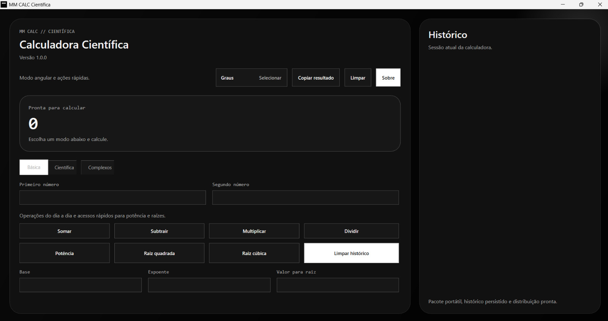

# MM CALC Científica

[](https://github.com/CyberReaper404/CalculadoraCientifica/actions/workflows/ci.yml)


Calculadora científica para Windows desenvolvida em `C# + WPF`, com visual minimalista em preto e branco, foco em usabilidade, empacotamento profissional e cobertura de testes automatizados.

Este projeto é uma releitura de uma calculadora originalmente criada para terminal no começo da faculdade e depois evoluída para uma experiência de aplicativo desktop com foco em portfólio, apresentação profissional e entrega real de produto.



## Sobre a evolução deste projeto

Esta calculadora foi desenvolvida originalmente em `2021`, como um projeto de faculdade em `Python`, com execução via terminal e navegação por menus.

Nesta nova fase, o projeto foi repaginado e evoluído para um aplicativo desktop para Windows, desenvolvido em `C# + WPF`, com interface gráfica, testes automatizados, empacotamento em instalador e documentação mais profissional.

O objetivo desta atualização não foi apagar a origem do projeto, mas mostrar com clareza a evolução técnica entre a versão acadêmica inicial e uma versão mais madura, pensada para portfólio e distribuição.

## Evolução

- `2021`: versão original em Python para terminal
- `2026`: reinterpretação como aplicativo desktop para Windows
- foco atual: qualidade visual, testes, empacotamento e apresentação profissional

## Visão geral

A aplicação reúne, em uma interface compacta com cara de app de calculadora, os principais recursos descritos no projeto original:

- operações básicas
- potência e raízes
- trigonometria com graus e radianos
- logaritmos
- números complexos
- histórico de operações

Além da repaginação visual, a lógica foi reorganizada, validada com testes e endurecida contra entradas inválidas, incluindo `NaN`, `Infinity` e domínios matemáticos incorretos.

## Tecnologias

- `C#`
- `.NET 8`
- `WPF`
- `MSTest`
- `UI Automation`
- `GitHub Actions`

## Recursos

- interface compacta, inspirada em calculadoras desktop
- tema preto e branco com estética minimalista
- modo angular alternável entre graus e radianos
- operações com números complexos em forma algébrica e polar
- histórico da sessão
- persistência local da sessão anterior
- botão de copiar resultado e informações da versão
- pacote portátil autossuficiente
- instalador via Inno Setup
- fluxo de compilação, testes e distribuição automatizado
- geração de hash SHA-256 para os artefatos oficiais

## O que este projeto demonstra

- refatoração de um projeto antigo para uma base mais organizada
- separação entre domínio matemático, interface e empacotamento
- testes automatizados de domínio e de interface
- cuidado com distribuição, integridade e documentação
- acabamento visual com identidade própria

## O que ele não tenta provar sozinho

Este projeto não foi desenhado para provar, isoladamente, experiência com sistemas distribuídos, autenticação complexa, integrações pesadas ou APIs de larga escala. Ele funciona melhor como peça de portfólio focada em produto desktop, qualidade de código, experiência de uso e processo de distribuição.

## Estudo de caso

Leitura recomendada para complementar o projeto:

- `docs/versao-original.md`
- `docs/estudo-de-caso.md`
- `docs/guia-de-distribuicao.md`
- `CHANGELOG.md`

## Como executar

### Opção 1: abrir como aplicativo

Abra o executável da pasta de distribuição:

`dist/MM-CALC-Cientifica-1.0.0-win-x64-portable/MMCalcCientifica.exe`

### Opção 2: instalar no Windows

Se o instalador tiver sido gerado:

`dist/installer/MM-CALC-Cientifica-Setup-1.0.0.exe`

### Opção 3: executar pelo terminal

No diretório raiz do projeto:

```powershell
dotnet build .\CalculadoraCientifica.Wpf\CalculadoraCientifica.Wpf.csproj
& ".\CalculadoraCientifica.Wpf\bin\Debug\net8.0-windows\MMCalcCientifica.exe"
```

## Testes

Sim, o projeto tem arquivos e projetos de testes dedicados.

Arquivos principais:

- `CalculadoraCientifica.Core.Tests/CalculadoraCientifica.Core.Tests.csproj`
- `CalculadoraCientifica.Core.Tests/ScientificCalculatorTests.cs`
- `CalculadoraCientifica.Wpf.UITests/CalculadoraCientifica.Wpf.UITests.csproj`
- `CalculadoraCientifica.Wpf.UITests/CalculatorUiTests.cs`

A suíte cobre:

- operações básicas
- divisão por zero
- potência e raízes
- seno, cosseno, tangente e funções inversas
- graus e radianos
- domínios inválidos de trigonometria e logaritmos
- números complexos
- rejeição de `NaN` e `Infinity`
- testes de fumaça automatizados da interface WPF
- interação automatizada com abas, campos, botões e visor da calculadora
- persistência da sessão entre execuções
- estados de erro na interface
- redimensionamento, rolagem vertical e acesso aos campos inferiores em janela reduzida

Para rodar os testes de domínio:

```powershell
dotnet test .\CalculadoraCientifica.Core.Tests\CalculadoraCientifica.Core.Tests.csproj
```

Para rodar os testes de interface:

```powershell
dotnet build .\CalculadoraCientifica.Wpf\CalculadoraCientifica.Wpf.csproj
dotnet test .\CalculadoraCientifica.Wpf.UITests\CalculadoraCientifica.Wpf.UITests.csproj
```

Estado atual da suíte:

- `56` testes de domínio e unidade
- `20` testes de interface automatizados
- `76` aprovados no total
- `0` falhas

## Segurança e integridade

Este projeto não executa scripts externos, não usa rede em tempo de execução, não carrega plugins dinamicamente e não depende de shell para funcionar como calculadora.

Medidas já aplicadas:

- validação de entradas matemáticas inválidas
- rejeição de valores não finitos
- lock file de dependências
- `NuGet.Config` com origem de pacote explícita
- fluxo de CI para validar compilação e testes
- fluxo de distribuição para gerar artefatos e hash SHA-256
- hash da versão para verificação de integridade

Leitura recomendada:

- `SECURITY.md`

Importante: em qualquer projeto de código aberto, ninguém consegue impedir totalmente que terceiros façam fork, modifiquem o código e redistribuam outra versão. O objetivo aqui é tornar a versão oficial mais verificável, previsível e difícil de adulterar silenciosamente.

## Estrutura do projeto

```text
CalculadoraCientificaDesktop/
|- CalculadoraCientifica.Core/
|- CalculadoraCientifica.Core.Tests/
|- CalculadoraCientifica.Wpf/
|- CalculadoraCientifica.Wpf.UITests/
|- installer/
|- scripts/
|- docs/
|- .github/workflows/
|- CHANGELOG.md
|- SECURITY.md
|- README.md
```

## Automação no GitHub

O repositório já está preparado com:

- `ci.yml`: restaura, compila e executa os testes de domínio e interface em `push` e `pull_request`
- `release.yml`: valida os testes, publica a versão Windows e gera `SHA256SUMS.txt` nas distribuições
- `.github/release.yml`: organiza categorias para notas de distribuição mais profissionais

Depois de criar o repositório no GitHub, atualize o badge dinâmico e os links do README com:

```powershell
powershell -ExecutionPolicy Bypass -File .\scripts\set-github-slug.ps1 -RepositorySlug "seu-usuario/seu-repositorio"
```

## Geração local

Fluxo recomendado para gerar os artefatos oficiais:

```powershell
powershell -ExecutionPolicy Bypass -File .\scripts\stage-release.ps1
```

Se você ainda não tiver o Inno Setup instalado:

```powershell
powershell -ExecutionPolicy Bypass -File .\scripts\stage-release.ps1 -SkipInstaller
```

## Próximos passos

- incluir capturas de tela ou um GIF no README
- adicionar assinatura de código ao executável
- publicar a primeira versão pública no GitHub
- lapidar a identidade visual final do ícone

## Autoria

Autora do projeto original: `Maria Eduarda Miyashiro`

Releitura desktop e estruturação atual: evolução do projeto original para uma versão de aplicativo Windows com foco em portfólio, usabilidade e organização de código.

## Licença

Este projeto está disponível sob a licença `MIT`.
